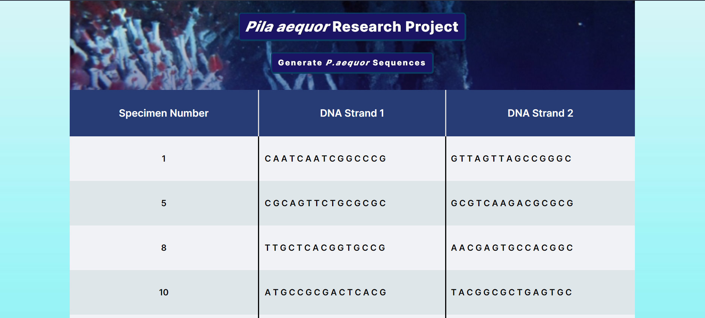

# [Mystery Organism JavaScript Project](https://tariq-k-dev.github.io/mystery-organism/)

Uses JavaScript to randomly generate a fifteen DNA base pair sequence comprised of at least 60% guanine (G) and cytosine (C) nucleic acid bases for a fictious deep sea organism _Pila aequor_. The higher G C content of the DNA is considered more likely to survive. The project was originally created as console app, so a print out of the generated results is still printed to the browser's console.

Browser local storage is used to persist the 30 generated DNA sequences. A new set of 30 organisms DNA can be generated using the <code>Generate <i>P .aequor</i> Sequences</code> button.

Below is a screenshot of the JavaScript code executed in the browser:

